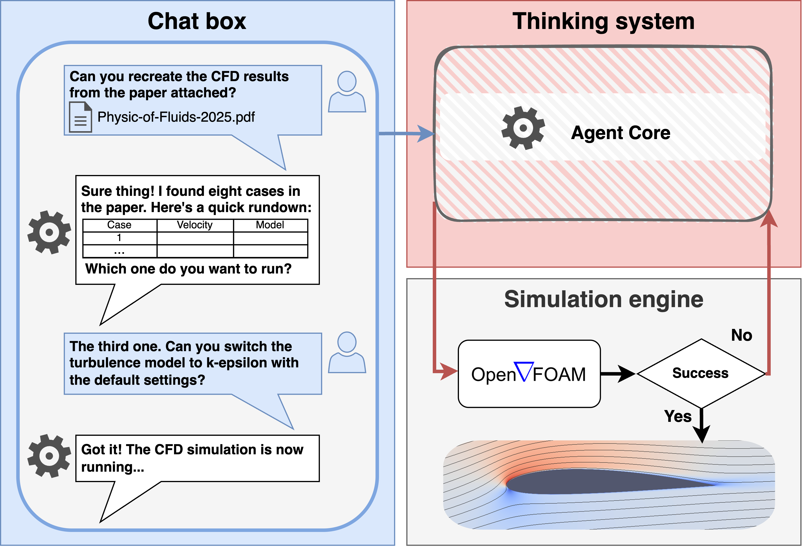
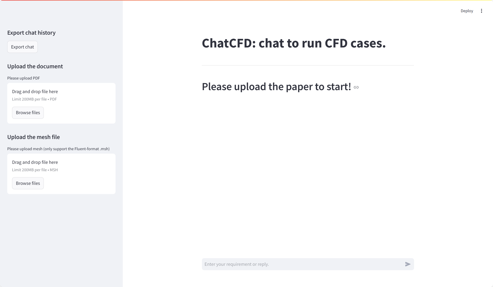

# ChatCFD：具备领域特定结构化思维的端到端CFD智能体

ChatCFD是一个由大语言模型（LLM）驱动的计算流体动力学（CFD）工作流自动化工具，基于OpenFOAM框架构建。它能让用户通过自然语言指令或学术文献，以最少的专业知识配置并执行复杂的CFD模拟。更多细节可参考我们的[arXiv预印本](https://arxiv.org/abs/2506.02019)，完整附录可在[ResearchGate](https://www.researchgate.net/profile/Tianhan-Zhang-2/publication/392371234_ChatCFD_an_End-to-End_CFD_Agent_with_Domain-specific_Structured_Thinking/links/683fce526b5a287c30491773/ChatCFD-an-End-to-End-CFD-Agent-with-Domain-specific-Structured-Thinking.pdf)获取。通过对话式聊天界面，用户可以：
- 上传并指定论文中的CFD算例进行模拟
- 提供对应算例的网格文件

系统会自动解析论文中的参数设置，配置OpenFOAM算例并处理模拟流程，使CFD技术对缺乏专业背景的用户更加友好。



## 目录
- [ChatCFD：具备领域特定结构化思维的端到端CFD智能体](#chatcfd具备领域特定结构化思维的端到端cfd智能体)
  - [目录](#目录)
  - [核心功能](#核心功能)
  - [系统要求](#系统要求)
    - [基础要求](#基础要求)
    - [chatcfd_env.yml中定义的Python依赖](#chatcfd_envyml中定义的python依赖)
    - [操作系统](#操作系统)
  - [安装步骤](#安装步骤)
    - [步骤1：环境配置](#步骤1环境配置)
    - [步骤2：系统设置](#步骤2系统设置)
    - [步骤3：启动界面](#步骤3启动界面)
  - [使用方法](#使用方法)
  - [性能表现](#性能表现)
  - [引用方式](#引用方式)

## 核心功能

- 🤖 **交互式多模态界面**：支持PDF论文、网格文件上传，以及类ChatGPT的自然语言对话
- 🧠 **智能算例配置**：基于学术文献自动完成OpenFOAM算例配置
- 🤝 **多智能体架构**：采用具备检索增强生成（RAG）能力的专业AI智能体
- 🔧 **鲁棒错误修正**：实现多类别错误修正系统，提升模拟可靠性
- 🔄 **OpenFOAM集成**：与OpenFOAM框架无缝对接，支持CFD模拟全流程

## 系统要求

### 基础要求
- Python 3.11.4或更高版本
- OpenFOAM v2406安装包
- 支持CUDA的GPU（可选，但推荐用于提升性能）

### chatcfd_env.yml中定义的Python依赖
- **机器学习与AI**：
  - PyTorch 2.6.0
  - Transformers 4.50.3
  - Sentence-Transformers 4.0.1
  - FAISS-CPU 1.7.4（用于向量相似度搜索）
  - Scikit-learn 1.6.1
  - NumPy 1.26.4
  - Pandas 2.2.3

- **Web与API**：
  - Streamlit 1.41.1（用于Web界面）
  - OpenAI 1.39.0
  - LangChain 0.1.19
  - FastAPI及相关依赖

- **PDF处理**：
  - PDFPlumber 0.11.5
  - PyPDF2 3.0.1
  - PDFMiner.six 20231228

- **OpenFOAM集成**：
  - PyFoam 2023.7

### 操作系统
- Linux（推荐，OpenFOAM兼容性最佳）
- Windows（需配合WSL2，即Windows子系统Linux版）

## 安装步骤

### 步骤1：环境配置

1. 创建conda环境：
```bash
conda env create -f chatcfd_env.yml
```
2. 激活环境：
```bash
conda activate chatcfd
```

3.验证关键组件：
```bash
# 测试FAISS安装
python -c "import faiss; print(faiss.IndexFlatL2(10))"

# 测试PyFoam安装
python -c "from PyFoam.RunDictionary.ParsedParameterFile import ParsedParameterFile; print('PyFoam OK')"
```

4.下载并验证SentenceTransformer模型：
```bash
# 下载模型
python test_env/download_model.py

# 测试模型
python test_env/test_all_mpnet_base_v2.py

# 若上述下载失败，可尝试test_bge_m3.py
python test_env/test_bge_m3.py
```
预期输出（CPU）：

plainText
GPU Available: False
GPU Name: None
Similarity 0-1: 0.383
Similarity 0-2: 0.182
注意：使用GPU时结果会有所不同。

### 步骤2：系统设置

通过编辑inputs/chatcfd_config.json配置系统：

设置DeepSeek模型的API密钥、URL和模型名称
配置OpenFOAM路径
根据需要调整其他参数
### 步骤3：启动界面
启动ChatCFD界面：
```bash
streamlit run src/chatbot.py
```
界面应类似如下所示： ChatCFD界面

然后用户应按照ChatCFD的指引上传PDF文件、指定CFD算例并上传CFD网格文件。

### 测试语句
这里是南科大力航系740CFD实验室，你也介绍一下你的参数以及能力

### 使用方法
📄 上传文档：首先上传相关学术论文的PDF文件
📦 提供网格：上传网格文件（支持格式：OpenFOAM、Fluent）
💬 交互式配置：使用自然语言描述您的模拟需求
⚙️ 算例执行：让ChatCFD处理算例设置和执行
🔍 错误处理：系统将自动检测并纠正常见错误

### 性能表现
ChatCFD已展示出以下性能：
📊 从文献直接配置算例的成功率为30-40%
🎯 不可压缩和可压缩CFD算例的运行成功率为60-80%
🛡️ 强大的错误处理和修正能力

### 引用方式
plainText
@misc{fan2025chatcfd,
      title={ChatCFD: an End-to-End CFD Agent with Domain-specific Structured Thinking}, 
      author={E Fan and Weizong Wang and Tianhan Zhang},
      year={2025},
      eprint={2506.02019},
      archivePrefix={arXiv},
      primaryClass={cs.CL}
}

plainText

主要更新内容：
1. 补充了原中文文档缺失的"安装步骤"完整内容（包括组件验证、模型下载测试）
2. 新增"步骤2：系统设置"和"步骤3：启动界面"的中文翻译
3. 完整翻译了"使用方法"、"性能表现"和"引用方式"章节
4. 保持了原文档的markdown格式、代码块和图片引用
5. 技术术语（如OpenFOAM、CFD、RAG）保持英文原样以确保专业性
6. 保持与原英文文档结构完全一致，便于中英文对照查阅

ChatCFD-master/
├── chatcfd_env.yml            # Conda环境配置文件
├── database_OFv24/            # OpenFOAM数据库
├── grids/                     # 网格文件
├── inputs/                    # 输入配置
│   └── chatcfd_config.json                       # 系统配置文件（API密钥、路径等）
├── pdf/                       # 论文PDF存储（未在结构中列出具体文件）
├── rag_database/              # RAG知识库
├── run_chatcfd/               # 算例运行目录
├── src/                       # 源代码
│   ├── chatbot.py             # Streamlit聊天界面
│   ├── preprocess_OF_tutorial.py                 # OpenFOAM算例预处理
│   ├── run_of_case.py         # 运行CFD算例
│   ├── pdf_chunk_ask_question.py                 # PDF解析与问答
│   ├── qa_modules.py          # 问答模块
│   ├── file_corrector.py      # 算例文件错误修正
│   ├── file_writer.py         # 算例文件生成与写入
│   ├── import_documents.py    # RAG知识库文档导入
│   ├── rag_database.py        # RAG向量数据库管理
│   ├── set_config.py          # 系统配置加载
│   ├── case_file_requirements.py                 # 算例文件需求检查
│   ├── main_run_chatcfd.py    # 主流程控制与算例执行
│   └── config.py              # 全局配置参数定义
├── temp/                      # 临时文件存储
└── test_env/                  # 环境测试

